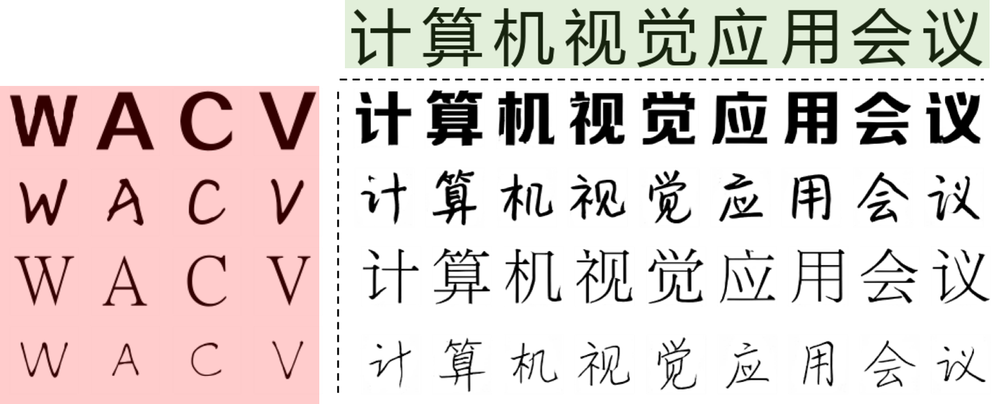
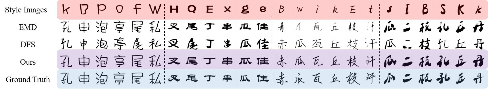
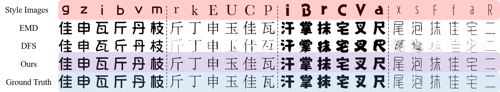
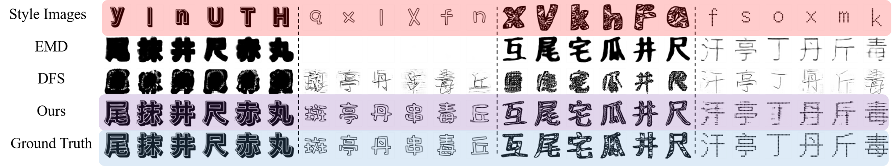

# FTransGAN in PyTorch

This is the implementation for the paper:

**Few-shot Font Style Transfer between Different Languages**

in Proc. of Winter Applications on Computer Vision WACV’21, Jan., 2021. 
[Paper](https://openaccess.thecvf.com/content/WACV2021/papers/Li_Few-Shot_Font_Style_Transfer_Between_Different_Languages_WACV_2021_paper.pdf).

<div  align="center">    

</div>

    
## Requirements

* Linux
* CPU or NVIDIA GPU + CUDA CuDNN
* Python 3
* torch>=0.4.1
* torchvision>=0.2.1
* dominate>=2.3.1
* visdom>=0.1.8.3

## How to use

- Download the [dataset](https://drive.google.com/file/d/1XJppxR00pyk5xG-64Ia_BF12XSxeZgfa/view?usp=sharing  "https://drive.google.com/file/d/1XJppxR00pyk5xG-64Ia_BF12XSxeZgfa/view?usp=sharing").
- Unzip it to ./datasets/
- To view training results and loss plots, run `python -m visdom.server` and click the URL http://localhost:8097.

- Train the model
```bash
bash ./train.sh
```
- Test
```bash
bash ./test.sh
```

- Evaluate
```bash
bash ./evaluate.sh
```

- scripts.sh integrate train.sh, test.sh, and evaluate.sh
```bash
bash ./scripts.sh
```
## Gallery





## Acknowledgements

Code derived and reshaped from:

[pix2pix](https://github.com/junyanz/pytorch-CycleGAN-and-pix2pix "https://github.com/junyanz/pytorch-CycleGAN-and-pix2pix")