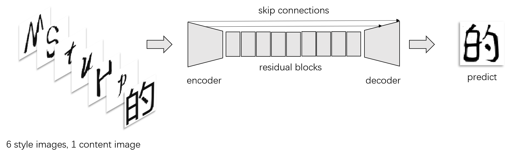
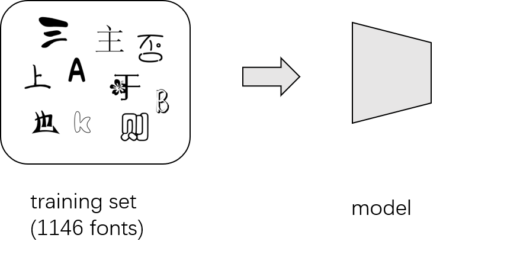
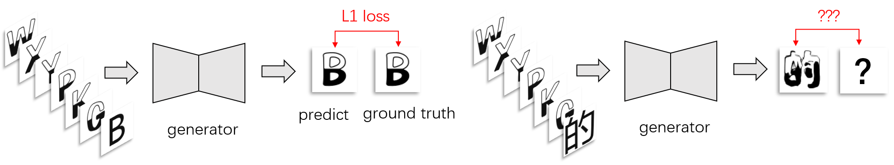
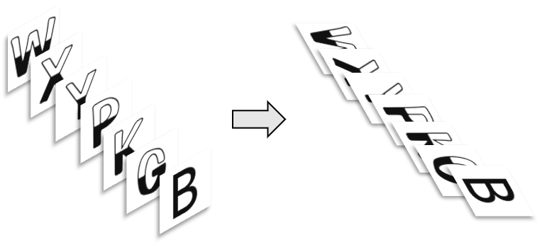

# font_translator_GAN


## Introduction

    
Learning font style between different languages with [GAN](https://arxiv.org/abs/1406.2661 "https://arxiv.org/abs/1406.2661"). This project shows the possibility of learning style information from other languages(e.g., English letters->Chinese characters).
    
Why use English letters to Chinese characters as an example? Chinese characters are very complicated, and the number of Chinese characters is huge(more than 20000). In addition, some components of Chinese characters do not appear in English letters. If I can transfer them automatically, this model can be applied to many languages.


## Network Structure


### Model Demonstration


The inputs are 6 style images (highly artistic English font) and 1 content image (common Chinese font, e.g., Microsoft Yahei). Inspired by [MC-GAN](https://arxiv.org/abs/1712.00516 "https://arxiv.org/abs/1712.00516") , I stack 7 images together and input them to the generator. The output is 1 Chinese character which has the same style with the input English letters and the same content with the input Chinese character.
    
The network structure is based on [pix2pix](https://arxiv.org/abs/1611.07004 "https://arxiv.org/abs/1611.07004") with some minor changes. The generator was added with 9 [resnet blocks](https://arxiv.org/abs/1512.03385 "https://arxiv.org/abs/1512.03385"), and the discriminator was split into two parts which are style discriminator and content discriminator. 
    
The loss function is L1 loss + GAN loss just like the [pix2pix](https://arxiv.org/abs/1611.07004 "https://arxiv.org/abs/1611.07004") model. Details will be introduced later.
    
### Generator


The structure of the generator is similar to [pix2pix](https://arxiv.org/abs/1611.07004 "https://arxiv.org/abs/1611.07004") with the addition of 9 [resnet blocks](https://arxiv.org/abs/1512.03385 "https://arxiv.org/abs/1512.03385"), and the first few layers and the last few layers are connected by [skip connections](https://arxiv.org/abs/1505.04597 "https://arxiv.org/abs/1505.04597").
    
### Style Discriminator


Why two discriminators? If I have only one, this discriminator will do 3 things at the same time. The first thing is to check the quality of the generated image, the second thing is to check the style of generated image and input English letters are matched or not, the last thing is to check the content of generated image and input Chinese character are matched or not. Doing so many things at the same time discriminator may be confused. So I divided it into two parts, 1 style discriminator and 1 content discriminator.
    
The structure of the style discriminator and the content discriminator are exactly the same, both of them use [patchGAN](https://arxiv.org/abs/1611.07004 "https://arxiv.org/abs/1611.07004") structure, but their inputs are different.The inputs of style discriminator are 6 style images(same images as the inputs of the generator) and 1 generated image.

### Content Discriminator


The inputs of content discriminator are 1 content image (the same image as the inputs of the generator) and 1 generated image.

## Training Details


### Pre-training


Inspired by [AGIS-NET](https://hologerry.github.io/AGIS-Net/ "https://hologerry.github.io/AGIS-Net/"), I divided the training step into two parts, pre-training and fine-tuning.

During the pre-training step, I train my model 10 epochs on the entire training dataset

### Fine-tuning


After pre-train the model on all fonts, I fine-tune the model on the specific fonts. Note that during the fine-tuning step, I don't have ground truth of Chinese characters. So I can only compute the L1 loss and GAN loss between the generated English letters and their ground truth. But I can also generate a Chinese character then regard it as a negative example input it to my discriminators. This process can also help train the model.



In the process of fine-tuning, another detail worth explaining is data augmentation. Compared with Chinese characters original English letters contain less structure information. In addition, because I regard all the generated Chinese characters as negative samples, the positive samples and the negative samples are not balanced. Therefore, it is necessary to do data augmentation. I choose many ways, such as rotate, flip.

For each font I fine-tune my model on 500~1000 steps.

## Gallery


### Compare with Ground Truth

Some results from the test set. The first row is 6 observed style images. I chose 6 most commonly used Chinese characters which are "的一是了我不" to show the results. The second row is generated images, and the last row is ground truth.


## Requirements

* Linux or macOS
* CPU or NVIDIA GPU + CUDA CuDNN
* Python 3
* torch>=0.4.1
* torchvision>=0.2.1
* dominate>=2.3.1
* visdom>=0.1.8.3

## Dataset

Dataset used in this project is available at [here](https://drive.google.com/file/d/1VEReXXgUtgZxBSYTeVO-l29GLKiau_ut/view?usp=sharing "https://drive.google.com/file/d/1VEReXXgUtgZxBSYTeVO-l29GLKiau_ut/view?usp=sharing").

## How to use

- Download the [dataset](https://drive.google.com/file/d/1VEReXXgUtgZxBSYTeVO-l29GLKiau_ut/view?usp=sharing "https://drive.google.com/file/d/1VEReXXgUtgZxBSYTeVO-l29GLKiau_ut/view?usp=sharing").
- Unzip it to ./datasets/
- To view training results and loss plots, run `python -m visdom.server` and click the URL http://localhost:8097.
- Train the model
```bash
bash ./train_font_translator_gan.sh
```
- Test
```bash
bash ./test_font_translator_gan.sh
```

## Acknowledgements

Code derived and reshaped from:

[pix2pix](https://github.com/junyanz/pytorch-CycleGAN-and-pix2pix "https://github.com/junyanz/pytorch-CycleGAN-and-pix2pix")